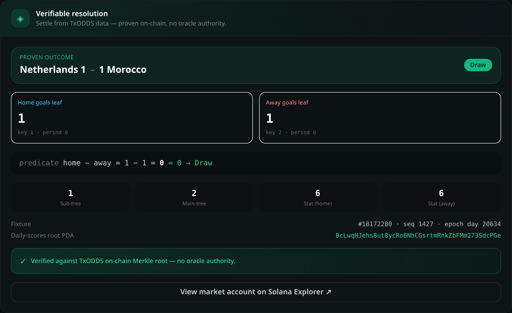

# ⚽ WorldCup Match Vault

**On-chain World Cup prediction markets on Solana that settle _trustlessly_ from TxLINE's
cryptographically-signed score data — no oracle authority in the settlement path.**

Built for the **TxODDS × Superteam — Prediction Markets & Settlement (World Cup)** track.

**🔗 Live demo (devnet):** https://worldcup-match-vault.vercel.app · **Program:** `E5ffcawirq6hVse98NJVDGQ4RSkkNAYWzN2RNoRAikzJ`



Users stake SOL on a match outcome (Home / Draw / Away). When the match is final, **anyone** can
submit TxLINE's three-stage Merkle proof of the score, and the market settles **only if TxODDS's own
on-chain program (`validate_stat`) confirms it** via a Cross-Program Invocation. Winners claim a
proportional share of the losing pools minus a 3% fee. No admin, relayer, or signer can override a
result — the only trust anchor is TxODDS's signed Merkle root.

> **Proven live on devnet** against real data: fixture `18172280` — **Netherlands 1‑1 Morocco (World
> Cup)** — settled to **Draw** through the `validate_stat` CPI, and the winning bettor claimed their
> payout. See [TECHNICAL.md](./TECHNICAL.md) for the on-chain transaction signatures.

---

## Why this is different

The track explicitly rewards **Custom On-Chain Settlement Engines** that CPI into `validate_stat`.
Most prediction markets trust an off-chain oracle to push the result. This one doesn't:

| | Typical oracle market | WorldCup Match Vault |
| --- | --- | --- |
| Who resolves | A trusted `oracle_authority` key | **Anyone**, permissionlessly |
| Trust assumption | "the oracle is honest" | **Cryptographic** — TxODDS's signed Merkle root |
| A wrong result | Possible if the key is compromised | **Impossible** — `validate_stat` returns `false`, tx reverts |
| Verifiability | Off-chain attestation | On-chain Merkle proof + a UI "receipt" |

## How it works

```
 create_market ──▶ place_bet ──▶ (full time) ──▶ resolve_market_trustless ──▶ claim_payout
   (binds a          (users,                        (anyone, with a TxLINE        (winners)
    TxLINE fixture     SOL)                          Merkle proof)
    + goal keys)                                          │
                                                          ▼  CPI
                                              TxLINE.validate_stat ─▶ bool
                                          (verifies the proof against the
                                           on-chain daily_scores_roots PDA)
```

`resolve_market_trustless` binds the proof to the market's fixture and goal stat-keys, enforces full
time, derives the predicate from the claimed outcome (`home − away  >0 / <0 / =0`), CPIs
`validate_stat`, reads the returned `bool` via `get_return_data`, and settles only on `true`. The
legacy `resolve_market` (oracle-signed) remains as a labelled fallback.

### Accounts & PDAs

- **Market** — `["market", match_id]` — teams, kickoff, per-outcome pools, the bound TxLINE
  `fixture_id` + goal stat-keys + full-time gate, and `settlement_kind` (oracle vs TxLINE proof).
- **Bet** — `["bet", market, bettor]` — one bet per wallet per market.
- **Vault** — `["vault", market]` — System-owned PDA custodying all staked SOL; payouts signed out by
  the PDA.

### Payout math

```
payout = bet_amount × total_pool × (1 − 3%) / winning_pool      // checked u128
```

## TxLINE integration

Primary data source throughout — see the full endpoint list in [TECHNICAL.md](./TECHNICAL.md) and an
honest API writeup in [FEEDBACK.md](./FEEDBACK.md). Highlights: `fixtures/snapshot` (markets),
`scores/snapshot` + `scores/stream` (live UI), `scores/stat-validation` (the three-stage Merkle proof
fed into settlement), and the on-chain `validate_stat` CPI. Access uses the **free World Cup tier**
(`subscribe(serviceLevelId=1, weeks=4)` on devnet — no TxL purchase).

## Project layout

```
programs/worldcup-match-vault/src/
  txline_cpi.rs                  validate_stat CPI + IDL-mirrored types + get_return_data
  instructions/resolve_market_trustless.rs   the trustless settlement engine
  instructions/{create_market,place_bet,claim_payout,resolve_market}.rs
  tests/vault_litesvm.rs         Rust LiteSVM suite (7 passing)
txline/                          TS: access bootstrap, TxLINE client, proof builder, devnet e2e
app/                             Next.js dApp: markets, betting, claims, Verifiable Resolution panel
TECHNICAL.md / FEEDBACK.md       submission docs
```

## Toolchain

Anchor 1.0.1 · Solana/Agave 3.1.14 · Rust 1.95 · Node 20 · Next.js 14.

## Build, test, run

```bash
# Program
anchor build
cargo test -p worldcup-match-vault --test vault_litesvm        # 7 passing
anchor deploy --provider.cluster devnet

# TxLINE access  → writes txline/credentials.json
cd txline && npm install && npm run bootstrap
npm run probe         # validates a real fixture's proof against validate_stat (read-only)
npm run e2e           # full devnet flow: create → bet → trustless settle → claim

# Frontend
cd ../app && npm install
cp .env.local.example .env.local    # set NEXT_PUBLIC_RPC_URL (devnet) + NEXT_PUBLIC_PROGRAM_ID
npm run dev                          # http://localhost:3000
```

## License

MIT
